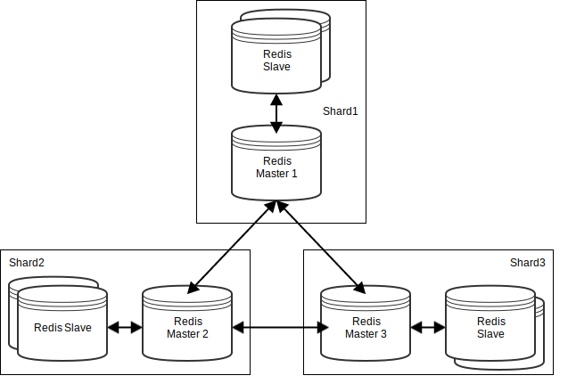
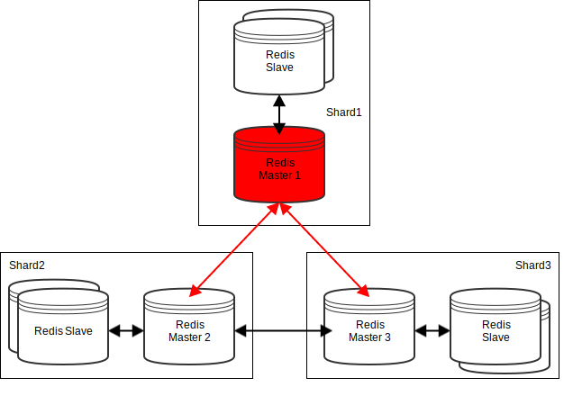
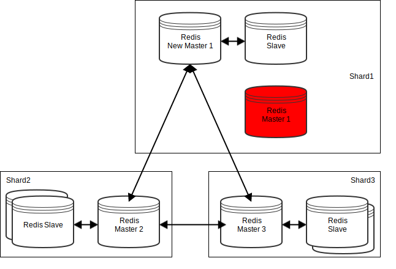
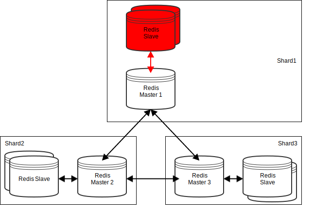
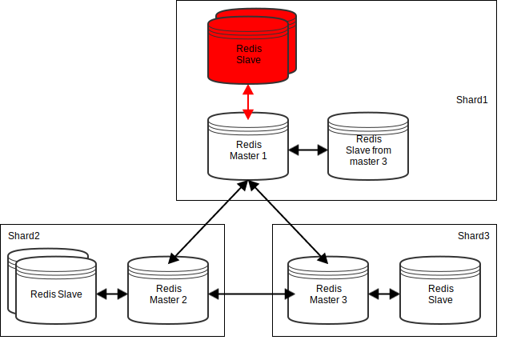
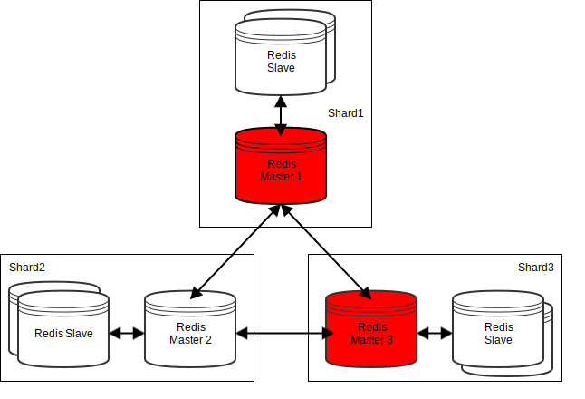

class: center, middle

# Redis

---

# Agenda

* C'est quoi Redis

* Exploitation

* Monitoring

* DEMO 1

* Redis Cluster

* Industrialisation VSCT

* DEMO 2

---

# C'est quoi redis ?
 
 * Key/Value Store
 
 * Toutes les données sont stockées `in memory`
 
 * Toutes les clées peuvent avoir (ou non) une date d'expiration (TTL)
 
 * Rapide (sur arola 80000 get/s et 100000 set/s)
 
 * Léger
 


---

# Mais aussi ...

 * La possibilité de persister les données sur disques
 
 * Des types de données avancées (Counter, List, Set, Sorted Set ...)
 
 * Un cache LRU out-of-the-box
 
 * Une fonctionnalité de Souscription / Publication (Broker de message léger)
 
 * De la réplication (Redis Sentinel)

 * Du Sharding (Redis cluster)
 
 * Très rapide
 
 
---

# Et pour finir (Sur l'intro)

 * Open sources (BSD licensed)
 
 * Une documentation très fournie (https://redis.io/documentation)
 
 * Développé en C ANSI
 
 * Aucunes dépendances externes

---

# Focus sur les perfs

 * Mono threadé
 
 * Tout doit être in-memory (Pas de swapping)
 
 * Impact de l'activation de la persistance fort

---

# Focus sur la persistance

 * RDB(Redis Database File) mode : point-in-time snapshot
 
 * AOF(Append Only File) mode : Chaque opération d'écriture est logguée
 
 * On peut activer l'un ou l'autre, les deux ou rien
 
 * Plus de détails ici : https://redis.io/topics/persistence

---

# Exploitation
 
 * Logs redis : Emplacement paramétrable, pas mal d'informations notamment sur le paramétrage système manquant

```
# WARNING: The TCP backlog setting of 511 cannot be enforced because 
/proc/sys/net/core/somaxconn is set to the lower value of 128.

# Server started, Redis version 3.2.6

# WARNING overcommit_memory is set to 0! Save may fail under low memory condition. 
To fix this issue add 'vm.overcommit_memory = 1' to /etc/sysctl.conf and then reboot.

# WARNING you have Transparent Huge Pages (THP) support enabled in your kernel. 
This will create latency and memory usage issues with Redis. 
To fix this issue run the command 
'echo never > /sys/kernel/mm/transparent_hugepage/enabled' as root, 
and add it to your /etc/rc.local in order to retain the setting after a reboot. 
Redis must be restarted after THP is disabled.

* The server is now ready to accept connections on port 6379
```
---

# Exploitation
 
 * redis_cli: Outils command line de redis
    
    + Autocomplétion et historisation des commandes
    
    + Mode interactif ou scripté
    
 * Commandes utiles
    
    + PING : réponse PONG
    
    + CLIENT * : Informations et actions sur les clients
    
    + CONFIG * : Informations et actions sur la configuration
    
    + Toutes les commandes ici : https://redis.io/commands

---

# Monitoring

La commande `INFO` fournit énormement de métriques : 

 * Généralitées sur redis (version, mode, uptime ...)
 
 * Utilisation CPU et mémoire
 
 * Statistique sur les clients
 
 * Information sur la persistances
 
 * Tous le détail ici : https://redis.io/commands/info


En mode cluster, il y a également les commandes : 
 
 * `CLUSTER INFO` 

 * `CLUSTER NODES`
 
 * Détail ici : https://redis.io/commands#cluster


---

class: center, middle
# DEMO
## Redis standalone
## Redis cli

---

# Redis Cluster

 * Complètement différent du mode HA avec redis sentinel
 
 * Permet de Sharder les données entre les differents noeuds du cluster (Pour la performance et du scalabilité)
 
 * Permet également d'être résilient à un certain nombres de pannes
 
 * Attention : Redis cluster utilise un port tcp supplémentaire pour la communication inter node. 
 Ce port n'est pas configurable (à moins de recompiler redis) et vaut le port redis standard + 10000
 

---
# Redis Cluster



---

# Redis Cluster : La résilience

 * Redis ne gère pas le partitionnement réseau. Il faut toujours une majorité de master UP,
  ainsi qu'un slave par master DOWN sinon la totalité du cluster sera DOWN.
 
 * Si nous avons la majorité, lorsqu'un noeud master est DOWN, il sera automatiquement remplacé par un de ses réplicas.
 L'operation prend la valeur du paramètre `cluster-node-timeout` plus quelques secondes.

 * Si un master n'a plus de slave, redis cluster va automatiquement lui en assigner un si des masters disposent de plus d'un slave

 * Attention : Si la persistance est désactivée et qu'un master est DOWN,
 mais revient (ex : supervision monit) avant une réélection, les données de ce noeud seront perdues.

---

# Redis Cluster : La résilience - Perte d'un master



---

# Redis Cluster : La résilience - Perte d'un master



---

# Redis Cluster : La résilience - Perte de tous les slaves d'un master



---

# Redis Cluster : La résilience - Perte de tous les slaves d'un master



---

# Redis Cluster : La résilience - Perte de la majorité des masters



---

# Redis Cluster : redis_trib.rb

 * Script ruby qui permet de wrapper les commandes redis cluster pour l'exploitation
    
    + status
    
    + création de cluster
    
    + resharding
    
    + rebalancing
    
    + etc. (Voir redis_trib.rb help)

---

# Industrialisation VSCT : ENC

 * Minimaliste, juste les informations nécessaire pour trouver le YAML.

 ```
  vsct_redis::install:
   applications:
      pao:
        plateformes:
          PREP1:
            components:
              PAO:
                instances:
                  PAOAROH11RED: {}
          PREP2:
            components:
              PAO:
                instances:
                  PAOAROH21RED: {}
 ```
 
---

# Industrialisation VSCT : YAML

* Mode standalone, cluster ou sentinel, gestion du stockage.

 ```
REDIS:
  - NAME: PAO
    USER: redpaoh1
    REDIS_VERSION: 3.2.1
    MODE: SHARD
    SHARD_OPTION:
      REPLICA_NUMBER: 2
    HOSTS:
      - NAME: AROLA
        IP: 10.98.67.180
        INSTANCES:
          - NAME: PAOAROH11RED
            PORT: 50000
      - NAME: BIZZARONE
        IP: 10.98.68.13
        INSTANCES:
          - NAME: PAOBIZH11RED
            PORT: 50000
 ```
 
---

# Industrialisation VSCT : Collectd

 * Plugin collectd rpm repris en interne, basé sur les commandes `INFO` et `CLUSTER INFO`
 
 ```
       PAO-PREP1:
         graphite_prefix: DT.PAO.remote.
         config:
           interval: 60
         modules:
           - redis
 ```
 
 * https://prep.appmetrics.vsct.fr/grafana/dashboard/db/tdc-pao-redis

---

# Industrialisation VSCT : Détail d'une installation

```
|-- BOOT
|-- PAO
|   |-- BOOT
|   |-- BOOT_PAOAROH11RED
|   |-- SHUT
|   |-- SHUT_PAOAROH11RED
|   |-- config
|   |   `-- redis_50000.conf
|   |-- data                                 # Données du cluster + persistance
|   |   `-- PAOAROH11RED
|   |-- logs                                 # Emplacements des logs
|   |-- rundeck_install
|   `-- scripts
|       |-- cluster_shard_exploit            # Utilitaire redis pour les clusters
|       |   |-- add_master_with_slaves.sh   
|       |   |-- init_cluster.sh             
|       |   |-- rebalance_cluster.sh        
|       |   `-- redis_trib_wrapper.sh       
|       `-- run50000.sh
|-- SHUT
`-- install_gems.sh
```

---

class: center, middle
# DEMO
## Industrialisation vsct
## Redis cluster
## Redis trib

---

# Sources
 
* https://redis.io
